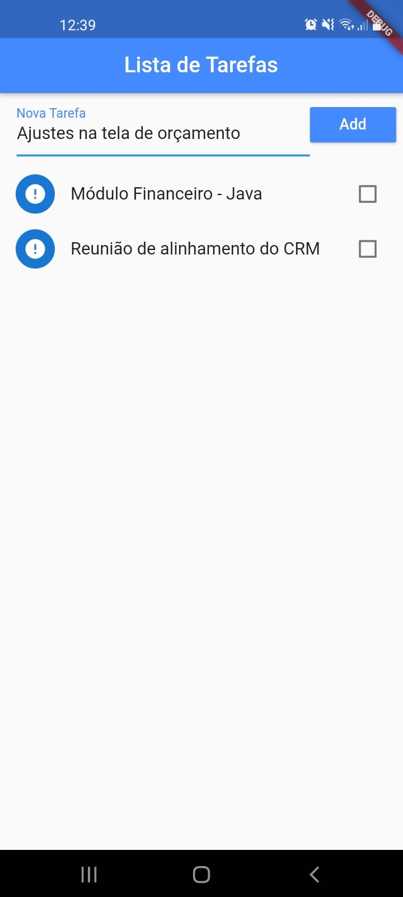

## App Flutter: Lista de tarefas

Permite adicionar, editar, excluir e desfazer exlusão de tarefas.

Salvando as informações em um arquivo .json

## Screenshot

Clone o projeto do repositório e executar os comandos abaixo:

flutter pub get

flutter run 

Adicionando uma nova tarefa

Excluindo tarefa

desfazendo a exclusão tarefa

